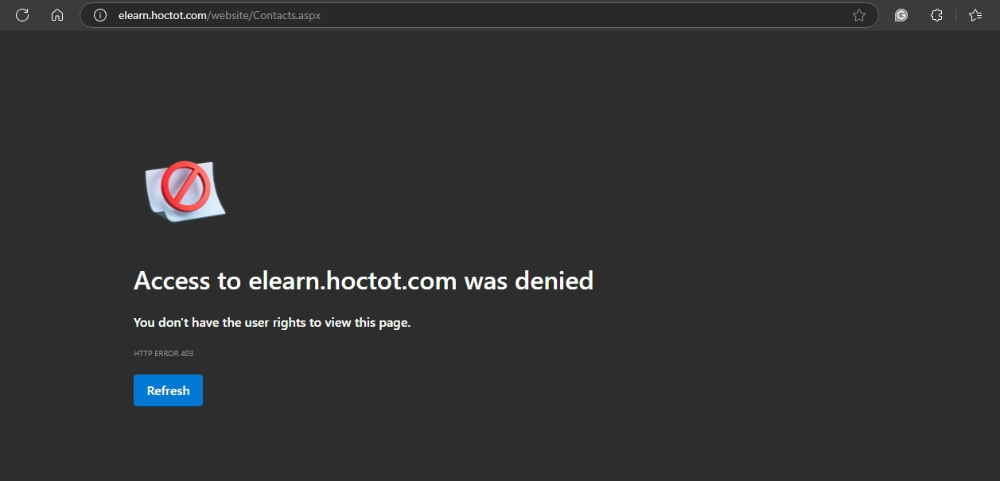

# mid-project-801277361

Đây là dự án giữa kỳ, chủ đề: HTTP server.
 

**Thành viên:**

- Nguyễn Văn Dũng - B21DCCN277
- Nguyễn Đức Hiếu - B21DCCN361
- Hoàng Gia Vương - B21DCCN801

## Mô tả

- Server nhận request từ client, xử lý và response.

### Dự án này bao gồm các phần sau:

- Server hỗ trợ các giao thức: HTTP/1.1 và HTTP/2
- Công nghệ: Java

## Tiến độ

### Tuần 1

- **Mục tiêu:** Server hỗ trợ giao thức HTTP/1.1 với GET và POST
- **Công việc đã làm:**
  <ul>
      <li>Xử lý đa luồng</li>
      <li>Đọc file cấu hình Json</li>
      <li>Phân tích Http request và gửi Http response. Hỗ trợ thành công HTTP/1.1 với GET và POST</li>
      <li>Cho phép Upload tài nguyên lên server</li>
  </ul>

### Tuần 2

- **Mục tiêu:** Thực hiện caching tài nguyên.
- **Công việc đã làm:**
    <ul>
        <li>Tìm hiểu redis, và cài đặt redis server</li>
        <li>Cache thành công tài nguyên, giảm thời gian đọc file từ ổ đĩa.</li>

    </ul>

### Tuần 3

- **Mục tiêu:** Server đóng vai trò như một Proxy đơn giản.
- **Công việc đã Làm:**
    <uL>
      <li>Cấu hình proxy trên client (SwitchyOmega)</li>
      <ul>
        <li>Scheme: HTTP</li>
        <li>Server: 127.0.0.1</li>
        <li>Port: 8080</li>
      </ul>
       
      <li>Chuyển tiếp request: server nhận http request, phân tích và chuyển tiếp chúng tới remote server.</li>
      <ul>
          <li>
            
          </li>
      </ul>
       
      <li>Hỗ trợ request CONNECT (Https), tạo kênh kết nối giữa client và remote server trên cổng mặc định 443.</li>
       
      <li>Thống kê request: server theo dõi lưu lượng truy cập trong một khoảng thời gian cố định</li>
      <ul>
        <li>localhost:8080/analysis</li>
        <li>
            
        </li>
      </ul>
       
      <li>Proxy có khả năng chặn một số trang web cụ thể.</li>  
      <ul>
        <li>
            
        </li>
      </ul>
  </uL>

 

- **Chức năng sắp triển khai:**
  <ul>
    <li>Proxy có khả năng Caching.</li>
  </ul>